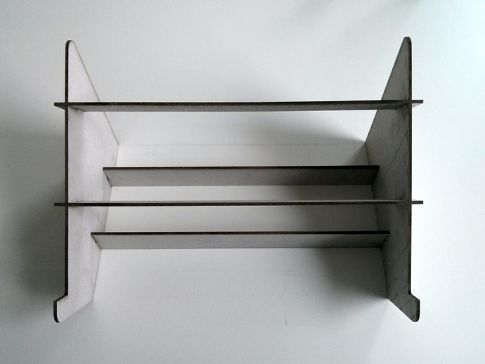
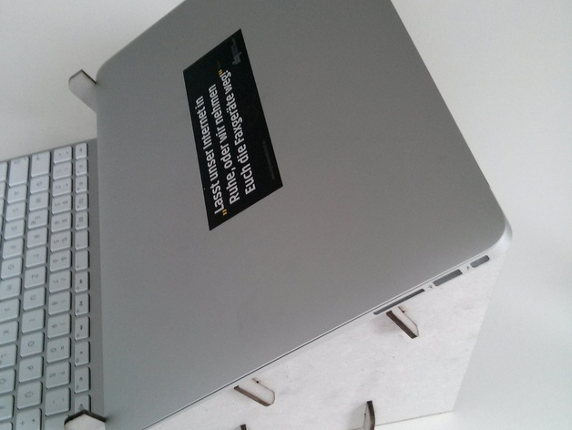

# Laser-cut DIY Laptop Stand

## Summary

Top View:

Side View:

The files here are an adoption of `emnullfuenf`'s [Cardboard Macbook Air Stand](http://www.thingiverse.com/thing:71405). The files were adopted to print two stands on a board sized 610x457mm which fits the VLS4.60 Laser cutter.

`emnullfuenf`'s design is in turn a remix of `AndrewSleigh`'s [Laser-cut Laptop Stand for Macbook Air](http://www.thingiverse.com/thing:22724).
